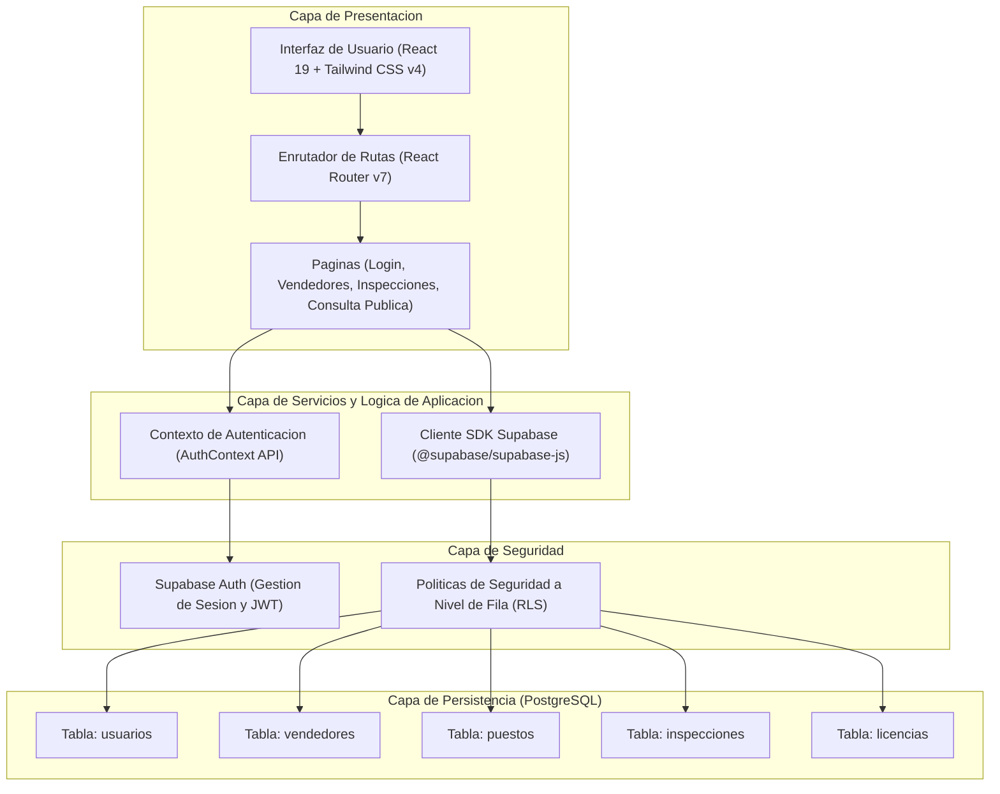

# INFORME TÉCNICO - PRÁCTICA CALIFICADA 2
## CURSO: PROYECTO FINAL DE CARRERA III (USIL 2026-1)
**Estudiante:** Erick Jair Espinoza Mayta

### ACCESOS PÚBLICOS DE SUSTENTACIÓN PARA EL EVALUADOR
* URL Pública de Producción (Vercel): https://pc-2-control-sanitario-ceviche-pota.vercel.app/
* Cuenta de Acceso Administrador (Supabase Auth):
  - Correo electrónico: erick@gmail.com
  - Contraseña de ingreso: erick123

---

## PREGUNTA 1: METODOLOGÍA DEVOPS Y STACK TECNOLÓGICA (2 PUNTOS)

### 1. Aplicación de los principios y fases de DevOps a la fiscalización sanitaria de carretillas de ceviche de pota
La fiscalización sanitaria de carretillas de ceviche de pota en la vía pública involucra riesgos sanitarios críticos, como la proliferación bacteriana por ruptura de la cadena de frío, intoxicaciones alimentarias y fraude de especies (venta de pota en mal estado o sustitución no declarada de ingredientes). La metodología DevOps se integra a este proceso para asegurar que la plataforma de software sea robusta, confiable, segura y se adapte rápidamente a las necesidades de fiscalización en campo.

* **Fase de Plan (Planificación):** En esta fase se definen los requerimientos de la fiscalización sanitaria en coordinación con la gerencia de salud municipal. Se priorizan historias de usuario enfocadas en la captura de datos críticos en campo. Se estructuran las tareas para mitigar el riesgo de salud pública mediante la identificación inmediata de puestos no conformes. Se planifican alertas automáticas e inspecciones basadas en la geolocalización y el historial sanitario de los puestos.
* **Fase de Code (Codificación):** Se implementa el código fuente de la aplicación móvil y web utilizando estándares estrictos de tipado con TypeScript. En esta fase se programa la lógica de negocio para validar que la temperatura de la pota registrada por el inspector esté dentro del rango seguro (menor o igual a 5 grados Celsius) y que se realice la verificación obligatoria de la especie para prevenir el fraude alimentario.
* **Fase de Build (Construcción):** Se compila la aplicación para empaquetar los módulos frontend y backend en un entregable optimizado. Durante esta fase se minimizan las hojas de estilo y el código JavaScript para garantizar que el inspector municipal, al usar su dispositivo móvil en zonas públicas con conectividad a internet limitada, pueda cargar el formulario de fiscalización sin experimentar demoras.
* **Fase de Test (Pruebas):** Se ejecutan validaciones automáticas y linters para descartar errores sintácticos, de tipado u otros fallos lógicos en la UI. Se asegura que los cálculos y comparaciones de temperatura de cadena de frío y DNI de vendedores se validen antes de que la aplicación envíe los datos al servidor, evitando el registro de datos corruptos o falsificados.
* **Fase de Release (Liberación):** Se etiqueta la versión candidata y se preparan las migraciones del esquema de base de datos relacional PostgreSQL en Supabase. El versionamiento semántico garantiza la trazabilidad ante eventuales incidentes en producción, permitiendo revertir cambios de forma segura si una actualización compromete la recolección de datos en campo.
* **Fase de Deploy (Despliegue):** El código validado se despliega de forma automática en la infraestructura en la nube de Vercel. Este flujo elimina la intervención humana en el despliegue de producción, garantizando consistencia total entre el entorno local y el productivo mediante un pipeline automatizado.
* **Fase de Operate (Operación):** Los inspectores sanitarios utilizan la aplicación móvil en tiempo real para fiscalizar carretillas. Los ciudadanos pueden escanear los códigos QR impresos en las carretillas para validar de forma instantánea si el puesto cuenta con licencia vigente y estado sanitario aprobado, democratizando la vigilancia de la salud pública.
* **Fase de Monitor (Monitoreo):** Se analizan los registros de acceso, consultas a la API de Supabase y tasas de error del sistema. El monitoreo técnico se alinea con el monitoreo epidemiológico: un incremento inusual en puestos con estado "Rechazado" o temperaturas superiores a 5 grados Celsius activa alertas para que las autoridades sanitarias realicen operativos focalizados de decomiso.

### 2. Justificación técnica de la stack tecnológica utilizada
El stack de desarrollo fue seleccionado para responder a las exigencias operativas de un sistema de fiscalización móvil en tiempo real y la gestión relacional estricta de la información recopilada:

* **React 19 (SPA de alto rendimiento):** Permite renderizar una interfaz interactiva de carga rápida sin refrescos completos de página. Esto optimiza el consumo de batería y datos móviles de los inspectores mientras realizan visitas consecutivas en la vía pública. React 19 introduce mejoras en la gestión de estados asíncronos y transiciones fluidas de los formularios.
* **Vite 8 (Compilación rápida):** Proporciona un entorno de desarrollo con Hot Module Replacement (HMR) casi instantáneo y una configuración de empaquetado optimizada con Rollup. Esto reduce significativamente los tiempos de desarrollo y compilación en el pipeline de CI/CD.
* **Tailwind CSS v4 (Diseño responsivo móvil optimizado):** Facilita la creación de un sistema de diseño premium adaptativo (Mobile-First). Al compilar únicamente las clases CSS utilizadas, minimiza el peso de los recursos descargados por los dispositivos en campo y garantiza una visualización perfecta en cualquier tamaño de pantalla.
* **TypeScript 6 (Tipado estricto anti-errores):** Mitiga riesgos en tiempo de ejecución al forzar al compilador a detectar inconsistencias en las variables y modelos de datos (por ejemplo, evitar que la temperatura se procese como cadena de texto en lugar de número, o asegurar que el UUID del vendedor siempre tenga el formato correcto).
* **Supabase PostgreSQL (Esquema relacional en 3FN con triggers):** La persistencia requiere integridad referencial estricta. PostgreSQL asegura el cumplimiento ACID en las transacciones de licencias e inspecciones. El uso de un esquema normalizado en 3FN previene la redundancia de datos. Los triggers automatizados en la base de datos actualizan el estado sanitario de las carretillas en cuanto se inserta una nueva inspección, eliminando lógica propensa a fallas en el lado del cliente.
* **Vercel (Distribución ágil a producción):** Plataforma Cloud que ofrece un despliegue optimizado para arquitecturas JAMstack. Con su red global de entrega de contenido (CDN), garantiza que los tiempos de respuesta de la SPA y la carga del portal público de consulta ciudadana sean mínimos para los vecinos y administradores.

---

## PREGUNTA 2: DIAGRAMAS DE CASOS DE USO Y ARQUITECTURA (2 PUNTOS)

### 1. Diagrama de Casos de Uso (UML)
El siguiente diagrama detalla las interacciones de los distintos actores con el sistema de control sanitario:

```mermaid
graph TD
    ActorAdmin[Administrador Municipal]
    ActorInspector[Inspector Sanitario]
    ActorCitizen[Vecino / Ciudadano]

    subgraph Sistema_de_Control_Sanitario["Sistema de Control Sanitario (Ceviche de Pota)"]
        UC1(Login administrativo)
        UC2(Registrar Vendedores y Puestos)
        UC3(Validar DNI del Vendedor)
        UC4(Registrar Inspeccion Sanitaria)
        UC5(Capturar Campo temperatura_pota)
        UC6(Verificar Campo verificacion_especie)
        UC7(Consultar Estado Sanitario via QR)
    end

    ActorAdmin --> UC1
    ActorAdmin --> UC2
    UC2 -.->|include|-> UC3

    ActorInspector --> UC1
    ActorInspector --> UC4
    UC4 -.->|include|-> UC5
    UC4 -.->|include|-> UC6

    ActorCitizen --> UC7
```

### 2. Arquitectura Lógica
Este modelo representa la distribución multicapa de la aplicación, definiendo el aislamiento de responsabilidades:



### 3. Diagrama de Arquitectura Física en la Nube
El siguiente modelo físico muestra los servidores, plataformas PaaS, flujos de datos e infraestructura desplegada:

```mermaid
graph TD
    subgraph Cliente["Dispositivo Cliente"]
        Browser["Navegador Web (Inspectores / Ciudadanos)"]
    end

    subgraph CDN_Vercel["Infraestructura Cloud (Vercel)"]
        VEdge["Vercel Edge Network (CDN)"]
        VApp["React SPA (Archivos HTML/JS/CSS Estaticos)"]
    end

    subgraph GitHub_Repo["Gestion de Codigo y CI"]
        Repo["Repositorio GitHub (Rama main)"]
        GHA["GitHub Actions Runner (ci.yml)"]
    end

    subgraph Platform_Supabase["Plataforma Cloud (Supabase)"]
        Gateway["API Gateway (PostgREST / Kong HTTPS)"]
        GoTrue["Modulo de Autenticacion (GoTrue Auth)"]
        Postgres["Base de Datos PostgreSQL (Instancia en AWS/OCI)"]
    end

    Browser -->|HTTPS Request| VEdge
    VEdge --> VApp
    Repo -->|Push Trigger| GHA
    GHA -->|Build & Validation| Repo
    Repo -->|Deploy Artifacts| VEdge
    VApp -->|Client Side SDK Call (REST / JWT)| Gateway
    Gateway --> GoTrue
    Gateway --> Postgres
```

---

## PREGUNTA 3: PLANIFICACIÓN CON SCRUM (6 PUNTOS)

### 1. Product Backlog e Historias de Usuario desarrolladas
La planificación del proyecto se estructuró en base a historias de usuario enfocadas en valor e integradas en Jira bajo la clave de proyecto PC2CP. A continuación se detallan las historias implementadas en su respectivo Sprint:

* **US1 (Jira: PC2CP-9):** Configuración del entorno de desarrollo inicial, estructura de carpetas en React/TypeScript e integración del SDK base de Supabase.
* **US2 (Jira: PC2CP-11):** Implementación del sistema de estilos global (Tailwind CSS v4) y el Layout administrativo para la navegación responsiva.
* **US3 (Jira: PC2CP-12):** Módulo de inicio de sesión administrativo utilizando el microservicio de Supabase Auth.
* **US4 (Jira: PC2CP-13):** Implementación de cierre de sesión seguro en el dashboard administrativo y destrucción de tokens de sesión local.
* **US5 (Jira: PC2CP-14):** Middleware de protección de rutas y redireccionamiento inteligente de usuarios basado en su estado de autenticación.
* **US6 (Jira: PC2CP-15):** Formulario de creación de nuevos vendedores autorizados con enlace a puestos.
* **US7 (Jira: PC2CP-16):** Validaciones numéricas estrictas del DNI de vendedores (longitud exacta de 8 caracteres).
* **US8 (Jira: PC2CP-17):** Vista de listado general de vendedores con búsqueda reactiva por texto.
* **US9 (Jira: PC2CP-18):** Implementación del borrado lógico de vendedores mediante la bandera de actividad para suspender carretillas.
* **US10 (Jira: PC2CP-24):** Formulario web para el registro de inspecciones sanitarias periódicas.
* **US11 (Jira: PC2CP-25):** Validaciones del registro de inspecciones sanitarias (temperatura de pota menor a 5 grados Celsius y confirmación de la especie).
* **US12 (Jira: PC2CP-26):** Módulo público de consulta ciudadana accesible mediante códigos QR vinculados a la URL de producción.
* **US13 (Jira: PC2CP-29):** Configuración de flujos automatizados de despliegue continuo (CD) en la nube de Vercel.

### 2. Estimación y Sprints
* **Técnica de Estimación (Story Points):** Se aplicó la técnica de Planning Poker utilizando la secuencia de Fibonacci modificada (1, 2, 3, 5, 8, 13) para estimar el esfuerzo y complejidad técnica de cada historia de usuario. Esta estimación considera el nivel de incertidumbre, complejidad del desarrollo frontend/backend y los requisitos de QA/pruebas.
* **Velocidad del Equipo:** La velocidad promedio del equipo fue determinada en 28 Story Points por Sprint, calculada a partir del desempeño histórico y la dedicación del recurso a tiempo completo.
* **Desglose de los Sprints Definidos:**
  * **Sprint 1 (Configuración de infraestructura y autenticación):** Duración de 1 semana. Alcance centrado en la creación del esquema relacional en base de datos, conexión de Supabase Auth y desarrollo de la pantalla de login con protección de rutas. Total: 24 Story Points.
  * **Sprint 2 (Core de Vendedores y Puestos):** Duración de 1 semana. Alcance enfocado en el desarrollo de la interfaz CRUD de gestión de vendedores, integración de validaciones de DNI y control de baja lógica. Total: 26 Story Points.
  * **Sprint 3 (Control Sanitario, Inspecciones y Cierre):** Duración de 1 semana. Alcance centrado en el formulario de inspecciones sanitarias, el trigger automático en base de datos para la actualización del estado de los puestos, la interfaz pública de consulta vía QR y la configuración final del pipeline de CI/CD. Total: 28 Story Points.

### 3. Ceremonias Scrum y Artefactos
Para asegurar la consistencia del backlog y el control del avance del proyecto se ejecutaron las ceremonias oficiales del marco ágil (Jira Tasks: PC2CP-101 a PC2CP-112):

* **Sprint Planning (Planificación):** Reunión inicial en la que se seleccionaron los ítems del Product Backlog prioritarios y se acordó el Sprint Goal. Cada historia se desglosó en subtareas técnicas.
* **Daily Scrum (Sincronización diaria):** Reuniones de 15 minutos en las que se revisaron impedimentos, el avance de las subtareas de desarrollo y la actualización del tablero de tareas.
* **Sprint Review (Revisión):** Demostración del incremento de software funcional realizado al final de cada Sprint ante los stakeholders, validando el cumplimiento del Sprint Goal.
* **Sprint Retrospective (Retrospectiva):** Análisis del proceso de ingeniería de software para identificar oportunidades de mejora en el pipeline de despliegue y calidad de código.
* **Definición de Listo (DoR - Definition of Ready):** Una historia de usuario está lista para ser planificada si cuenta con criterios de aceptación claros en lenguaje Gherkin, mockups de diseño aprobados, estimación en Story Points y dependencias técnicas resueltas.
* **Definición de Terminado (DoD - Definition of Done):** Una historia de usuario está terminada si su código fuente no tiene advertencias del linter, pasa la compilación estricta de TypeScript, se encuentra fusionada en la rama de integración, cuenta con revisión de código aprobada y el despliegue automático en Vercel funciona correctamente.

### 4. Marcadores para Evidencias de Gestión

[INSERTAR CAPTURA DE PANTALLA 1: BACKLOG GENERAL Y SPRINTS COMPLETADOS EN JIRA]

[INSERTAR CAPTURA DE PANTALLA 2: VISTA DE LISTA CON SUBTAREAS TÉCNICAS ASIGNADAS A ERICK ESPINOZA EN ESTADO DONE]

---

## PREGUNTA 4: IMPLEMENTACIÓN Y DESPLIEGUE EN NUBE (10 PUNTOS)

### 1. Base de Datos Relacional vs NoSQL e Integración ACID
Para el sistema de control sanitario, se eligió una base de datos relacional (PostgreSQL en Supabase) sobre soluciones NoSQL debido a los siguientes motivos de diseño:

* **Integridad Referencial:** Es crítico que ninguna inspección sanitaria quede huérfana. PostgreSQL garantiza a través de llaves foráneas estrictas (`FOREIGN KEY`) que cada inspección obligatoriamente apunte a un puesto válido y a un inspector registrado. En un motor NoSQL (como MongoDB), mantener esta integridad requiere lógica del lado de la aplicación propensa a inconsistencias.
* **Cumplimiento ACID:** Las licencias de funcionamiento municipales y los resultados de fiscalización demandan transacciones consistentes. Si el estado de una inspección se registra como "Rechazado", el estado del puesto debe cambiar a "Rechazado" en una única transacción atómica. La consistencia y el aislamiento evitan que un puesto figure con licencia aprobada si la inspección de control determinó un riesgo grave de contaminación.
* **Normalización en Tercera Forma Normal (3FN):**
  * La tabla `usuarios` almacena a los inspectores/administradores autenticados (PK: `id` vinculada a `auth.users`).
  * La tabla `vendedores` almacena los datos de identidad y contacto de los comerciantes sin duplicar información (PK: `id`, DNI único).
  * La tabla `puestos` representa las carretillas de ceviche (PK: `id`, FK: `vendedor_id` que apunta a `vendedores`). Esto permite que un vendedor tenga uno o más puestos sin redundancia de datos.
  * La tabla `licencias` asocia los permisos legales a un puesto de forma única o histórica (PK: `id`, FK: `puesto_id` apuntando a `puestos`).
  * La tabla `inspecciones` registra las evaluaciones sanitarias (PK: `id`, FK: `puesto_id` a `puestos`, FK: `usuario_id` a `usuarios`).

A continuación se describe el diseño físico relacional:
* **Tabla `usuarios`**: `id` (UUID, Primary Key), `nombre` (VARCHAR), `email` (VARCHAR), `rol` (VARCHAR), `created_at` (TIMESTAMP).
* **Tabla `vendedores`**: `id` (UUID, Primary Key), `nombres` (VARCHAR), `apellidos` (VARCHAR), `dni` (VARCHAR, UNIQUE), `email` (VARCHAR, NULL), `telefono` (VARCHAR, NULL), `activo` (BOOLEAN, DEFAULT true), `created_at` (TIMESTAMP).
* **Tabla `puestos`**: `id` (UUID, Primary Key), `codigo_unico` (VARCHAR, UNIQUE), `ubicacion` (TEXT), `tipo_carretilla` (VARCHAR), `estado_sanitario` (VARCHAR, DEFAULT 'Sin Inspeccion'), `vendedor_id` (UUID, Foreign Key a `vendedores.id`), `created_at` (TIMESTAMP).
* **Tabla `inspecciones`**: `id` (UUID, Primary Key), `puesto_id` (UUID, Foreign Key a `puestos.id`), `usuario_id` (UUID, Foreign Key a `usuarios.id`), `fecha_inspeccion` (TIMESTAMP), `resultado` (VARCHAR), `estado_sanitario` (VARCHAR), `temperatura_pota` (NUMERIC), `verificacion_especie` (BOOLEAN), `observaciones` (TEXT, NULL), `created_at` (TIMESTAMP).
* **Tabla `licencias`**: `id` (UUID, Primary Key), `numero_licencia` (VARCHAR, UNIQUE), `puesto_id` (UUID, Foreign Key a `puestos.id`), `fecha_emision` (DATE), `fecha_vencimiento` (DATE), `estado` (VARCHAR), `created_at` (TIMESTAMP).

Se configuró un trigger en PostgreSQL (`trg_update_puesto_estado_sanitario`) que ejecuta la función `fn_update_puesto_estado_sanitario()`. Este trigger se activa ante cualquier inserción (`AFTER INSERT`) en la tabla `inspecciones`, extrayendo el `resultado` de la inspección y actualizando de forma automática el campo `estado_sanitario` en la tabla `puestos` para el registro coincidente, garantizando integridad física inmediata en el estado de la carretilla.

### 2. Estrategia de Branching (Git Flow)
Se implementó un flujo de trabajo Git Flow controlado para aislar el código en desarrollo del entorno de producción:

* **Rama `main` (Producción):** Almacena el código fuente estable de producción. Cualquier push en esta rama desencadena el despliegue automático a producción en Vercel.
* **Rama `develop` (Desarrollo):** Rama de integración donde se consolidan las funcionalidades validadas de los desarrolladores.
* **Ramas `feature/` (Funcionalidades):** Ramas de corta duración creadas a partir de `develop` para aislar el trabajo en historias específicas (por ejemplo, `feature/vendors` y `feature/inspections`). Se fusionan de regreso a `develop` mediante Pull Requests tras pasar pruebas locales.
* **Conventional Commits:** Se aplicaron reglas estrictas de mensajes de commit para automatizar el historial de cambios del repositorio, utilizando prefijos normalizados (ej. `feat(vendors): PC2CP-15...`, `fix(auth): PC2CP-26...`, `docs: PC2CP-29...`, `chore(database): PC2CP-32...`).
* **Pull Requests (PR):** Toda fusión entre ramas requiere la creación de un PR en GitHub, lo que permite la revisión de código por pares y la ejecución de pipelines de validación automatizada antes de la integración final.

### 3. Evidencia del Pipeline CI/CD
El proyecto cuenta con un flujo de trabajo de integración continua configurado en el archivo `.github/workflows/ci.yml`. Este pipeline ejecuta de forma automática los siguientes pasos ante eventos de `push` o `pull_request` dirigidos a las ramas `main` y `develop`:

1. **Checkout del Repositorio:** Descarga el código fuente en el runner virtual (Ubuntu Latest).
2. **Configuración del Entorno Node.js:** Instala Node.js versión 20 y activa la caché del gestor de paquetes npm para acelerar ejecuciones posteriores.
3. **Instalación de Dependencias:** Ejecuta `npm ci` para instalar de forma limpia las dependencias exactas definidas en `package-lock.json`.
4. **Validación de Estilos y Buenas Prácticas (Linter):** Ejecuta `npm run lint` utilizando ESLint para auditar la calidad del código, asegurando que no existan variables sin usar u otros problemas estáticos.
5. **Compilación y Tipado (Build):** Ejecuta `npm run build`, que corre el compilador de TypeScript (`tsc`) para verificar tipos y luego compila los archivos estáticos a través de Vite. Si hay errores de tipado o de compilación, el pipeline falla y se bloquea la integración.

[INSERTAR CAPTURA DE PANTALLA 3: REPOSITORIO DE GITHUB CON LA CARPETA .GITHUB/WORKFLOWS]

[INSERTAR CAPTURA DE PANTALLA 4: PESTAÑA ACTIONS DE GITHUB CON LA EJECUCIÓN EXITOSA DEL PIPELINE CI]

---

### RESUMEN DE CREDENCIALES DE REVISIÓN PARA EL EVALUADOR
* Entorno de Producción: [https://pc-2-control-sanitario-ceviche-pota.vercel.app/](https://pc-2-control-sanitario-ceviche-pota.vercel.app/)
* Cuenta de Pruebas: erick@gmail.com
* Contraseña: erick123
* Ubicación del Pipeline: .github/workflows/ci.yml
